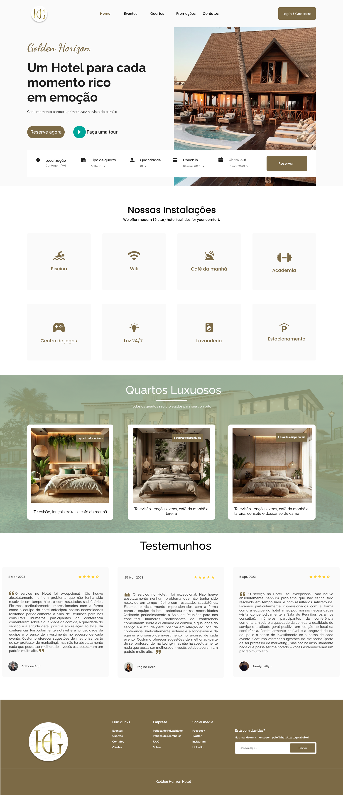

# 4. PROJETO DO DESIGN DE INTERAÇÃO

## 4.1 Personas
Nesta seção você deve detalhar as personas do seu projeto. Deve-se documentar uma persona por integrante do projeto. Sugere-se a utilização do gerador de personas disponibilizado ao final da página https://www.rdstation.com/blog/marketing/persona-o-que-e/.

## Persona 1: Carla Martins

- **Idade:** 32 anos.  
- **Profissão:** Gerente de Hotel.  
- **Localização:** Florianópolis, SC.  
- **Formação:** Administração Hoteleira.  
- **Tecnologia:** Avançada em sistemas de gestão e redes sociais.  
- **Objetivos:** Melhorar a eficiência do atendimento no hotel e aumentar a taxa de ocupação.  
- **Desafios:** Gerenciar uma equipe pequena, lidar com alta rotatividade de hóspedes e manter a organização mesmo em alta temporada.

## Persona 2: Bruno Lopes

- **Idade:** 27 anos.  
- **Profissão:** Analista de Marketing Digital.
- **Localização:** São Paulo, SP.
- **Formação:** Publicidade e Propaganda.
- **Tecnologia:** Heavy user de aplicativos e plataformas digitais.
- **Objetivos:** Planejar uma viagem de férias prática e econômica.
- **Desafios:** Falta de tempo para organizar hospedagem e detalhes da viagem.

## Persona 3: Rafael Silva

- **Idade:** 45 anos
- **Profissão:** Empresário
- **Localização:** Goiânia, GO
- **Formação:** Administração
- **Tecnologia:** Usa notebook e apps de viagem básicos
- **Objetivos:** Reservar hotéis para viagens de negócios com rapidez
- **Desafios:** Encontrar opções confortáveis próximas a centros empresariais

## Persona 4: Juliana Freitas

- **Idade:** 23 anos.
- **Profissão:** Estudante universitária.
- **Localização:** Recife, PE.
- **Formação:** Graduação em andamento.
- **Tecnologia:** Usa smartphone e redes sociais para tudo.
- **Objetivos:** Viajar gastando pouco e conhecer novos lugares.
- **Desafios:** Orçamento limitado e busca por promoções confiáveis.

## Persona 5: Paulo Mendes

- **Idade:** 54 anos.
- **Profissão:** Médico.
- **Localização:** Porto Alegre, RS. 
- **Formação:** Medicina.
- **Tecnologia:** Usa tablet e computador, prefere sites simples.
- **Objetivos:** Reservar hotéis tranquilos para descanso em viagens curtas.
- **Desafios:** Falta de tempo para pesquisar e preferência por processos rápidos.

## Persona 6: Flávia Borges

- **Idade:** 25 anos.
- **Profissão:** Influencer de turismo.
- **Localização:** Rio de Janeiro, RJ. 
- **Formação:** Turismo.
- **Tecnologia:** Adepta ao uso de smartphones e todo tipo de mídia social.
- **Objetivos:** Planejar viagens e reservar hotéis para que possa produzir conteúdo para suas mídias sociais.
- **Desafios:** Obter informações de qualidade para que possa programar sua produção de conteúdo.

## 4.2 Mapa de Empatia
Mapa da Empatia é um material utilizado para conhecer melhor o seu cliente. A partir do mapa da empatia é possível detalhar a personalidade do cliente e compreendê-la melhor. O objetivo é obter um nível mais profundo de compreensão de uma persona. A seguir um exemplo de template que pode ser usado para o mapa de empatia. Para cada persona deverá ser apresentado o seu respectivo mapa de empatia. Sugere-se a utilização do template apresentado em https://www.rdstation.com/blog/marketing/mapa-da-empatia/.

## Mapa de Empatia — Carla Martins

| Categoria        | Descrição |
|------------------|-----------|
| **O que ela vê?** | Hotéis concorrentes adotando novas tecnologias. Equipes sobrecarregadas. Necessidade de digitalizar processos. |
| **O que ela ouve?** | Feedbacks de hóspedes pedindo agilidade. Proprietário exigindo relatórios. Recomendações de fornecedores para inovação. |
| **O que ela pensa e sente?** | Preocupação com boas avaliações. Insegurança com sistemas difíceis. Desejo de modernizar o hotel. |
| **O que ela fala e faz?** | Incentiva a equipe. Pesquisa soluções digitais. Participa de treinamentos. |
| **Dores** | Falta de integração nas reservas. Processos manuais causam atrasos. Dificuldade para gerar relatórios. |
| **Ganhos** | Agilidade no check-in/check-out. Controle de reservas em tempo real. Dados para decisões rápidas. |

## Mapa de Empatia — Bruno Lopes

| Categoria        | Descrição |
|------------------|-----------|
| **O que ele vê?** | Muitos hotéis, mas informações incompletas. Sites de reserva pouco claros. |
| **O que ele ouve?** | Indicações de amigos que priorizam praticidade. Reviews negativos sobre check-ins demorados. |
| **O que ele pensa e sente?** | Ansiedade para garantir boa hospedagem. Frustração com processos burocráticos. Desejo de praticidade. |
| **O que ele fala e faz?** | Compara hotéis rapidamente. Procura avaliações. Prefere check-in online e transparência. |
| **Dores** | Sites confusos no celular. Falta de transparência de preços. Reservas complicadas. |
| **Ganhos** | Reserva rápida e segura. Confirmações automáticas no celular. Facilidade de avaliação pós-estadia. |

## Mapa de Empatia — Rafael Silva

| Categoria        | Descrição |
|------------------|-----------|
| **O que ele vê?** | Sites de hotel de difícil navegação e sistemas de reserva precários. |
| **O que ele ouve?** | Indicações de colegas e outros empresários do ramo. Hotéis que oferecem preços competitivos. |
| **O que ele pensa e sente?** | Medo de acomodações de má qualidade. Frustração com atrasos e falhas de comunicação. Desejo de conforto e agilidade. |
| **O que ele fala e faz?** | Faz comparações ponderadas sobre custo-benefício entre hotéis. Procura informações sobre preços e promoções. |
| **Dores** | Sites sem informações claras sobre preço. Falhas nos sistemas de reserva de quartos. |
| **Ganhos** | Preços competitivos. Amplas informações sobre as acomodações. Reservas, check-ins e check-outs rápidos. |

## Mapa de Empatia — Juliana Freitas

| Categoria        | Descrição |
|------------------|-----------|
| **O que ela vê?** | Muitas propagandas de promoções e descontos em reservas de hotéis, mas nem sempre de plataformas confiáveis. |
| **O que ela ouve?** | Porpagandas em sites. Experiências de conhecidos. Avaliações on-line. |
| **O que ela pensa e sente?** | Medo de golpes. Anseio por encontrar bons descontos. Desejo de obter boas experiências custo-benefício. |
| **O que ela fala e faz?** | Está sempre atenta por promoções. Sempre procura saber se a plataforma que está utilizando é segura. |
| **Dores** | Plataformas não confiávies. Falta de informaçõees sobre promoções.  |
| **Ganhos** | Notificações sobre promoções e descontos. Plataformas e sistemas de reserva seguros. |

## Mapa de Empatia — Paulo Mendes

| Categoria        | Descrição |
|------------------|-----------|
| **O que ele vê?** | Muitos sites e plataformas de reserva com layouts confusos e impráticos. |
| **O que ele ouve?** | Propagandas na internet. Recomendações de amigos e colegas de trabalho. |
| **O que ele pensa e sente?** | Valoriza primeiras impressões. Frustração com sites confusos e com informações supérfluas. Desejo de facilidade. |
| **O que ele fala e faz?** | Não permanece por muito tempo em sites que não o agradam. Não dá segundas chances a sistemas de reserva precários.  |
| **Dores** | Sites difíceis de navegar. Erros frequentes em sistemas de reservas. |
| **Ganhos** | Sites visualmente agradáveis. Sites com informações claras e organizadas. Sistema da reservas robusto. |

## Mapa de Empatia — Flávia Borges

| Categoria        | Descrição |
|------------------|-----------|
| **O que ela vê?** | Sites de hotéis com poucas informações detalhadas sobre quartos e serviços. |
| **O que ela ouve?** | Tendências no mundo do turismo. Interesse dos seus seguidores nas mídias sociais. |
| **O que ela pensa e sente?** | Espera conseguir produzir conteúdo de qualidade. Odeia não conseguir estabelecer um cronograma de suas atividades. |
| **O que ela fala e faz?** | Busca hotéis com amplas informações. Procura opiniões nas redes sociais. É bastante vocal em seus perfis sobre suas frustrações com hotéis e serviços. |
| **Dores** | Sites de hotéis com poucas informações. Não conseguir agendar serviços e amendidades previamente. Sites mal configurados para smartphones. |
| **Ganhos** | Informações amplas e atualizadas sobre quartos, serviços e atividades dos hotéis. Acessibilidade em smartphones. |

## 4.3 Protótipos das Interfaces
O desenvolvimento das interfaces do site do hotel foi guiado pelos princípios das heurísticas de Nielsen e pelos fundamentos da Gestalt, com foco na criação de uma experiência de navegação intuitiva, eficiente e visualmente agradável para diferentes perfis de usuários. Em todas as telas projetadas, como a página inicial, listagem de quartos, seção de ofertas, detalhes das acomodações, reservas, pagamento, contato e eventos, buscou-se garantir a visibilidade do status do sistema, permitindo que o usuário identifique facilmente sua localização e etapa de interação, por meio de títulos claros, menus de navegação bem posicionados e elementos visuais de destaque. A compatibilidade entre o sistema e o mundo real foi assegurada com o uso de terminologia acessível, imagens representativas e ícones intuitivos, facilitando o reconhecimento das funções e reduzindo possíveis dúvidas durante a navegação. O controle e a liberdade do usuário foram priorizados através da disponibilização de botões de ação objetivos e diretos, possibilitando a realização de tarefas como reservas, cadastros e pagamentos de forma rápida e sem ambiguidades. A consistência e a padronização visual foram mantidas ao longo de todas as páginas, com a utilização de uma identidade gráfica coesa, incluindo paleta de cores uniforme, tipografia padronizada e disposição lógica dos elementos de interface, o que reforça a previsibilidade e a segurança durante o uso. A prevenção de erros foi considerada por meio da organização clara das informações, da redução de etapas desnecessárias e da oferta de opções de escolha evidentes, minimizando a chance de falhas operacionais. Além disso, a sobrecarga de memória do usuário foi reduzida com a exposição direta das informações essenciais em cada tela, evitando a necessidade de memorização de dados entre etapas. O design também foi pensado para atender tanto usuários iniciantes quanto os mais experientes, promovendo flexibilidade e eficiência de uso. Esteticamente, optou-se por um visual minimalista e moderno, com espaços em branco bem distribuídos, textos objetivos e imagens de alta qualidade, o que contribui para a clareza e o conforto visual. Por fim, os princípios gestálticos de proximidade, similaridade, figura-fundo e continuidade foram aplicados de maneira estratégica, proporcionando uma estrutura visual que favorece a organização da informação, a escaneabilidade do conteúdo e a orientação do olhar do usuário, consolidando assim um projeto de interface coerente, funcional e alinhado às boas práticas de design de interação.

### Protótipo

O protótipo funcional do site pode ser acessado por meio do link abaixo:

**Link para o protótipo no Figma:** (https://www.figma.com/proto/8CnCq1819lJ7sJoHUpcsxa/Hotel-website---mobile-app--Community-?node-id=306-854&p=f&t=b2BZDjuoGjUZdSpn-1&scaling=scale-down&content-scaling=fixed&page-id=19%3A10&starting-point-node-id=306%3A854)

### Imagens das Páginas

As imagens correspondentes às páginas do site estão listadas abaixo:

#### Página Inicial (Home)

##### Objetivo da Tela
A tela inicial do site visa apresentae de prontidão as informações mais relevantes sobre o hotel e a navegação do site. Ao entrar, o usuário pode ver o menu de navegação no topo, links para as páginas de reserva e para um vídeo-tour, e um menu que agiliza o processo de reserva de quartos.
Ao rolar a página, o usuário tem acesso a mais informações relevantes, como serviços oferecidos pelo hotel, detalhes sobre os quartos e testemunhos de clientes.

---
#### Quartos

##### Objetivo da Tela
A página de Quartos mostra detalhes sobre os quartos, com fotos, descrições, informações sobre serviços e amenidades, bem como comentátios de clientes. 
O usuário pode também iniciar o processo de reserva nesta tela. Ao final da página há informações sobre outros tipos de quartos disponíveis.

---
#### Ofertas

##### Objetivo da Tela
A página de Ofertas dispõe informações sobre oportunidades de desconto oferecidas pelo hotel. Cada oferta é representada por um card, com uma foto do quarto, informações sobre o tipo de quarto, sua avaliação, seu preço base e o desconto atual, bem como a quantidade de noites disponíveis.

---
#### Login e Cadastro

##### Objetivo da Tela
A páginas de Login e Cadastro apresentam um layout simples, dando destaque apenas ao formulário necessário ao processo.

#### Contatos

##### Objetivo da Tela
A página de contatos visa facilitar o processo do cliente entrar em contato com o hotel. A página não só exibe informações básicas como telefones, endereço de email e links para mídias sociais, mas também oferece funcionalidades para que o usuário envie mensagens via Whatsapp, ou para que envie um email preenchendo um formulário simples.

  

#### Reserva

#### Eventos

##### Objetivo de Tela
A página de Eventos exibe informações sucintas sobre os espaços do hotel que podem ser reservados para eventos. Um vídeo tour, bem como o destaque de belas imagens destes espaços visam instigar potenciais clientes.

#### Pagamento

##### Objetivo da Tela
A página de Pagamentos visa oferecer uma experiência clara e de fácil navegação, sem abrir mão da identidade visual do site. Informações e formulários são agrupados em caixas, tornando sua exibição organizada, direta e elegante.

## Código Fonte

Todos os arquivos de código referentes ao site estão disponíveis neste repositório na pasta chamada "golden-horizon". O conteúdo pode ser clonado, analisado ou executado localmente para fins de avaliação.

